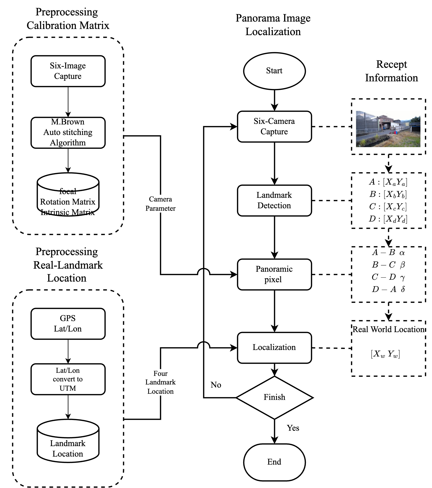
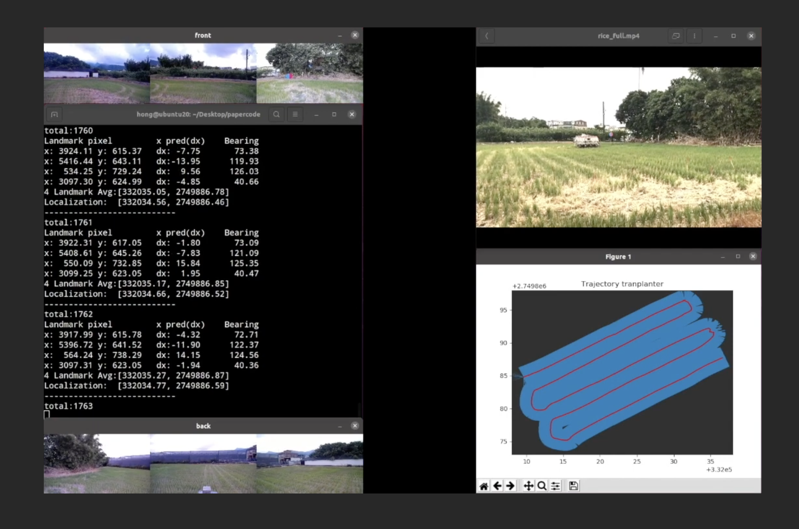

# Paper_Code
This is the use of the surroundings method of positioning in the application of agricultural vehicle navigation and positioning system design.
### Paper : Autonomous Navigation System for Agricultural Vehicles Using Machine Vision Recognition and Localization of Panoramic Landmarks.
Compile this code:

```
cd ~/Paper_code
make clean
make
```

System flowchart:


Visualize:



(https://www.youtube.com/watch?v=GgkYmTRFHzA)
